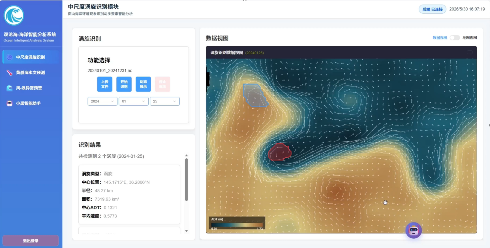
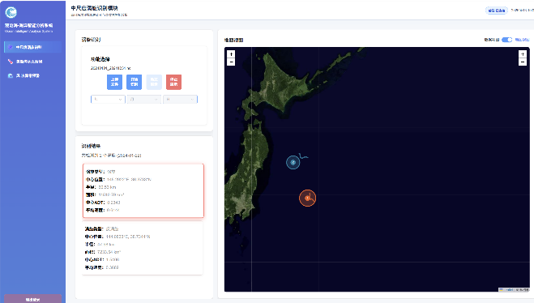
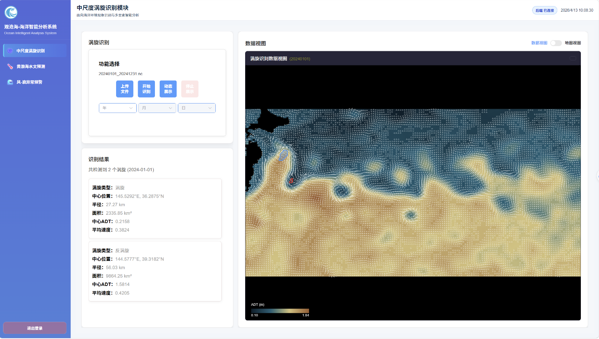
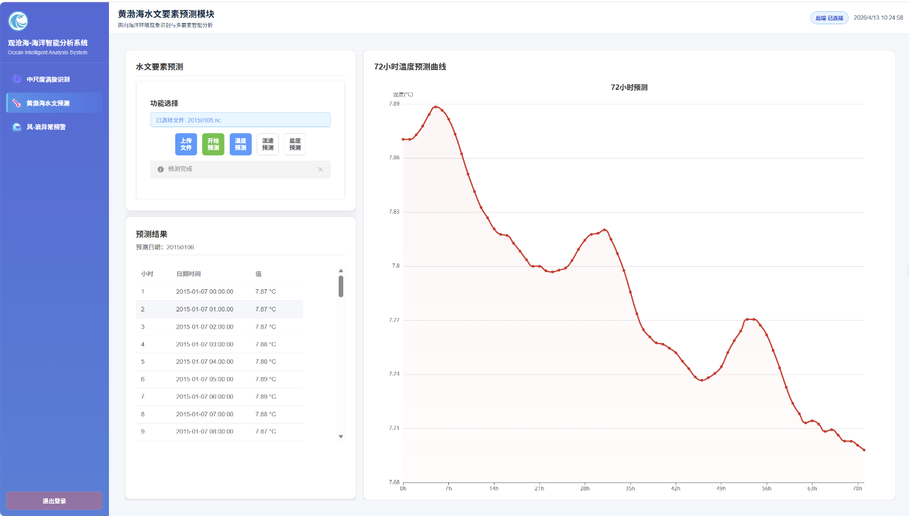
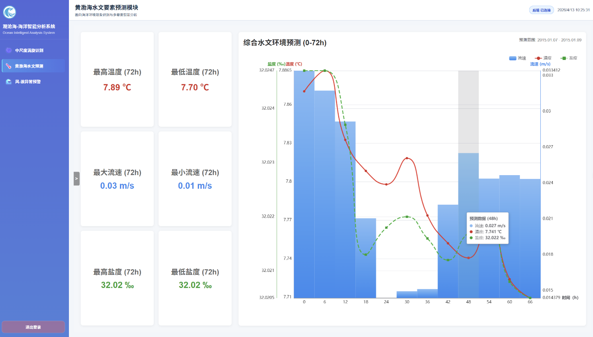
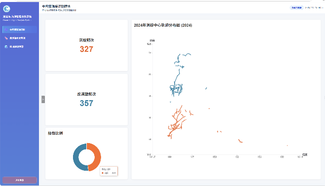

# 海洋环境现象识别与多要素智能分析系统

> 面向海洋环境监测的一站式智能分析平台，集成中尺度涡旋识别、水文要素 72 小时预测、风浪异常预警与 DeepSeek AI 智能助手。第十四届中国大学生软件杯竞赛 **国家级二等奖**，本人担任 **前端负责人**。

## 📸 项目页面展示

### ✨ 核心功能亮点

| 智能AI助手 | 地图交互主界面 |
|:---:|:---:|
|  |  |
| 内置大模型智能助手，支持自然语言查询海洋数据、生成分析报告 | WebGIS 海洋地图交互，支持图层控制、区域缩放与要素查询 |

### 🔍 智能分析预测

| 涡旋智能识别分析 | 海水温度趋势预测 |
|:---:|:---:|
|  |  |
| 海洋中尺度涡旋自动识别、标注与特征分析 | 海水温度多时段趋势预测可视化展示 |

### 📊 数据统计面板

| 水文要素数据统计 | 综合数据概览 |
|:---:|:---:|
|  |  |
| 多维度水文要素指标分项统计与可视化 | 全海域综合运行数据汇总看板 |
## 🛠 技术栈


- **前端架构**：Vue3 + Vite + Pinia（Atlas 三层模块化：app / core / modules / shared）
- **数据可视化**：ECharts + Canvas
- **地图开发**：Leaflet
- **AI 能力**：DeepSeek API（流式输出 SSE / 多轮对话上下文 / 前端 Agent 交互封装）
- **后端**：FastAPI 聚合服务（涡旋识别 / 水文预测 / 风浪预警）

## ✨ 核心功能

### 三大业务模块
- **中尺度涡旋识别**：基于海洋遥感数据自动识别涡旋，Leaflet 地图可视化标注与动态展示
- **水文要素 72 小时预测**：温度、盐度、流速等多要素时序预测与 ECharts 图表联动展示
- **风浪异常预警**：实时监测风浪数据，异常情况自动预警，支持任务异步提交与轮询

### AI 智能助手 🤖
- 基于 DeepSeek 大模型搭建海洋领域专属 AI 智能助手
- 支持**流式输出（SSE）**、多轮对话上下文管理
- 封装通用大模型请求 Hook，支持模型切换与超时重试
- 完成前端 Agent 交互层的工程化封装

## ⚡ 性能亮点

针对海量水文数据图表渲染卡顿问题，自主实现**数据分片加载与增量渲染**方案，封装通用格式化工具函数处理张量 / 数组非标返回数据，将万级数据图表渲染耗时**降低 60%**。

## 📂 项目结构

```text
├─ frontend/              # Vue3 + Vite 前端（本人独立负责）
│  ├─ src/
│  │  ├─ app/             # 应用入口层
│  │  ├─ core/            # 核心基础设施
│  │  ├─ modules/         # 业务模块（eddy / hydro / windwave / overview）
│  │  ├─ shared/          # 共享组件与工具函数
│  │  └─ views/
│  └─ docs/               # 前端架构 / 操作 / 组件文档
├─ apis/                  # FastAPI 聚合服务入口与路由
├─ peddy/                 # 涡旋推理核心能力
├─ predict/               # 水文与流速推理资产
└─ warning/               # 风浪预警推理资产
```

## 🔌 前后端接口

| 接口 | 功能 | 前端模块 |
|------|------|---------|
| `POST /predict` | 涡旋识别 | eddy |
| `POST /temp_salt/predict` | 水文要素预测 | hydro |
| `POST /wind_wave/predict` | 风浪识别预警 | windwave |
| `GET /health` | 后端健康检查 | — |

前端默认后端地址：`http://localhost:8000`，可通过环境变量 `VITE_API_BASE_URL` 调整。

### 风浪预警低内存模式

当设备内存不足时，可启用临时接口模式（跳过模型推理，读取固定月份数据）：

- `WINDWAVE_TEMP_MODE=1`：启用临时接口
- `WINDWAVE_TEMP_MONTH=202509`：指定读取月份（默认 202509）

临时接口保持原有任务生命周期与输出契约，支持与原接口无缝切换。

## 🚀 本地运行

### 启动后端

```bash
# 安装 Python 依赖
pip install fastapi uvicorn python-multipart
pip install -r peddy/requirements_api.txt

# 启动服务（项目根目录执行）
python3 -m apis.api
# 服务地址：http://localhost:8000
```

### 启动前端

```bash
cd frontend
npm install
npm run dev
# 开发地址：http://localhost:5173
```

### 生产构建

```bash
cd frontend
npm run build
```

> ⚠️ **注意**：AI 助手功能需配置 DeepSeek API Key 才可使用，请勿将密钥提交到公开仓库。

## 💾 可执行文件

Windows x64 桌面端可执行文件：[下载 v1.0.0](https://github.com/jada-xiaoyu-guo/ocean-ai-platform/releases/tag/v1.0.0)

## 🏆 获奖情况

- 第十七届中国大学生服务外包创新创业大赛 **国家级二等奖**（2026.08）

